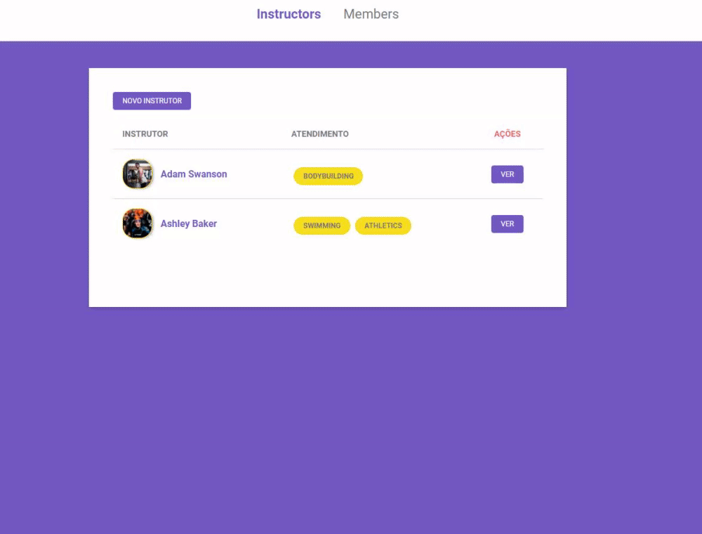

<h1 align="center">
    
</h1>

# Gym Manager 

> Gerencie sua academia com uma aplicação ágil e com uma bela interface 💪

## 🚀 Tecnologias utilizadas

As seguintes tecnologias foram utilizadas

- **[JavaScript](https://developer.mozilla.org/pt-BR/docs/Web/JavaScript)**
- **[Node.js](https://nodejs.org/en/)**
- **[Nunjucks](https://mozilla.github.io/nunjucks/)**

### 📕 Bibliotecas

- [x] [Browsersync](https://www.browsersync.io/)
- [x] [npm-run-all](https://www.npmjs.com/package/npm-run-all)
- [x] [File System | Node.js](https://nodejs.org/api/fs.html)
- [x] [method-override](https://www.npmjs.com/package/method-override)

### 🌉 API's

- [x] [Unsplash Source](https://source.unsplash.com/)

## 📌 Recursos

- Gerenciar instrutores
- Gerenciar membros

## 🎥 Demonstrações

**Tabela de instrutores**

[](https://gyazo.com/c82520885db824edec8c0078df5a0c2c)

---

**Criando instrutor**

[](https://gyazo.com/408ffbae4cc6f98d48c348159bb5053a)


---

**Criando membro**

[](https://gyazo.com/beadcf253d21e3b4583bdb5d247a5825)

**Edição de perfil (instrutor/membro)**


---

**Exclusão de perfil (instrutor/membro)**



---

## 👨‍💼 Instalação do projeto

Primeiramente você precisa ter o [Node.js](https://nodejs.org/en/download/) instalado, em seguida **rode o seguinte comando:**

``` git 

git clone https://github.com/LeonardoCampello-dev/Gym-Manager.git

```

**Para instalar as dependências**

``` node

npm install

```

## 💨 Rodando projeto 

Execute o seguinte comando para iniciar a aplicação em um ambiente de desenvolvimento

``` node

npm start

```

## 🧾 Licença

Projeto realizado em 2020. Este projeto está sob a [licença MIT](/LICENSE).

---

## Feito com 💚 por Leonardo Campello