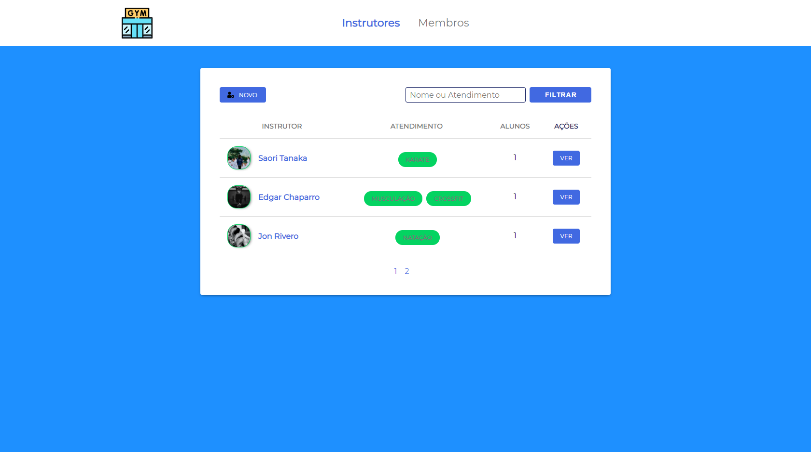
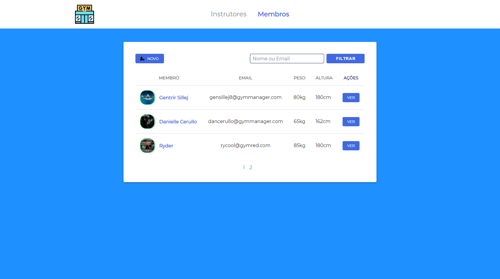
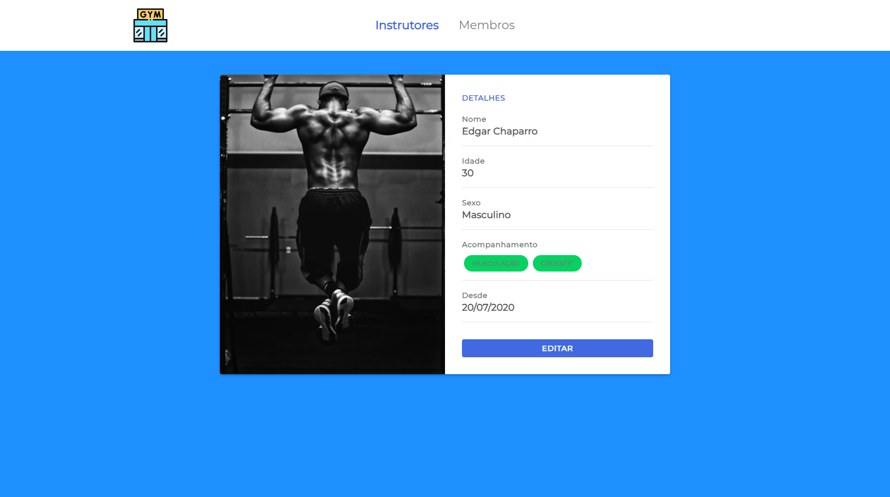
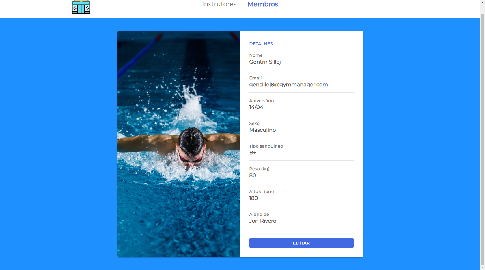

<h1 align="center">
        
</h1>

<h1 align="center">Gym Manager 🥇</h1>

<h4 align="center">

· [Report bug](#-contribuindo)
    
</h4>

<h2> 📘 Index </h2>

- [�‍🏫 About](#-about)
  - [📌 Resources](#-resources)
- [🚀 Technology](#-technology)
  - [📚 Libraries](#-libraries)
  - [🔌 APIs](#-apis)
- [🎬 Demonstration](#-demonstration)
- [☕ Prerequisites](#-prerequisites)
- [🔧 Installing](#-installing)
- [💿 Using](#-using)
- [📮 Contributing](#-contributing)
- [🤟 Collaborators](#-collaborators)
  - [😎 Become a contributor](#-become-a-contributor)
- [📜 License](#-license)

## 👨‍🏫 About 

> Manage your gym with an agile application and a beautiful interface 💪

### 📌 Resources

- Manage instructors
- Manage members

## 🚀 Technology 

- [JavaScript](https://developer.mozilla.org/pt-BR/docs/Web/JavaScript)
- [Node.js](https://bashjs.org/en/)
- [PostgreSQL](https://www.postgresql.org/)

### 📚 Libraries 

- [browsersync](https://www.browsersync.io/)
- [npm-run-all](https://www.npmjs.com/package/npm-run-all)
- [fs](https://nodejs.org/api/fs.html)
- [method-override](https://www.npmjs.com/package/method-override)
- [node-postgres](https://www.npmjs.com/package/pg) 


### 🔌 APIs 

- [unsplash Source](https://source.unsplash.com/)

## 🎬 Demonstration

**Instructors table**



---

**Members table**



---

**Instructor card**



**Member card**



---

## ☕ Prerequisites

Before getting your hands dirty, make sure you meet the following requirements:

- [ ] Have Node.js installed
- [ ] Have PostgreSQL installed

## 🔧 Installing 

To install, follow the steps:

``` bash 
git clone https://github.com/LeonardoCampello-dev/Gym-Manager.git
```

``` bash
## to install the dependencies

npm install
```

## 💿 Using

To use, follow the steps:

``` bash
## Run the following command to start the application in a development environment

npm start
```

## 📮 Contributing 

If this is your first contribution, [see the following tutorial.](https://github.com/firstcontributions/first-contributions)

## 🤟 Collaborators 

We thank the following developers who contributed:  

<table>
  <tr>
    <td align="center">
      <a href="#">
         <br>
        <sub>
          <b>Leonardo Campello</b>
        </sub>
      </a>
    </td>
  </tr>
</table>

### 😎 Become a contributor  

Would you like to be part of this project? Click [HERE](https://github.com/firstcontributions/first-contributions) and read the instructions to contribute.

## 📜 License

Made in 2020. This project is under the [MIT license.](./LICENSE)

<h2> Made with 💚 by Leonardo Campello </h2>