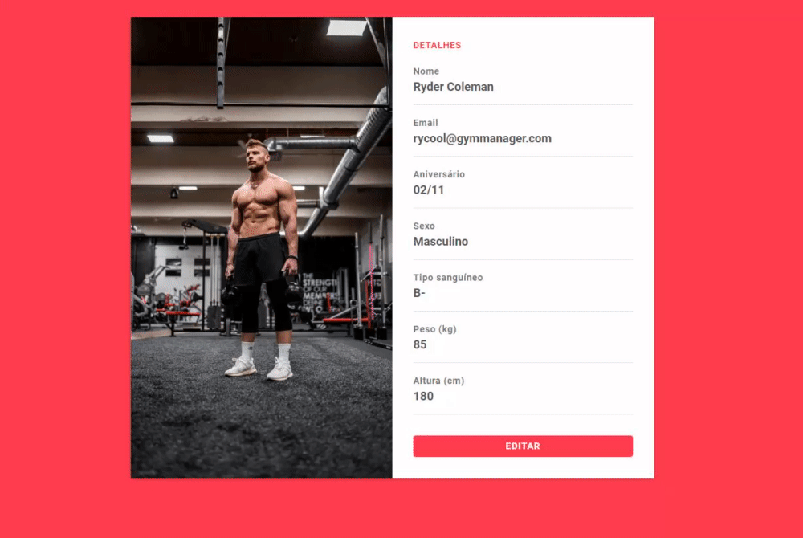
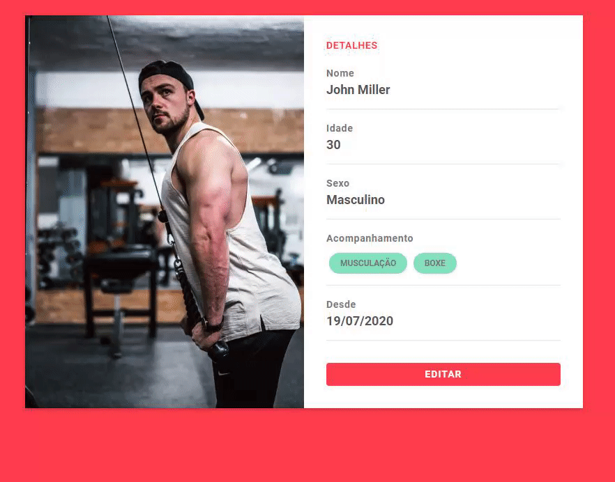

<h1 align="center">
    
</h1>

# <center> Gym Manager 🥇 </center> 

[](https://github.com/ellerbrock/open-source-badges/)
[](https://github.com/Naereen/StrapDown.js/blob/master/LICENSE)


> Manage your gym with an agile application and a beautiful interface 💪

## 🚀 Technologies used

The following technologies were used

- **[JavaScript](https://developer.mozilla.org/pt-BR/docs/Web/JavaScript)**
- **[Node.js](https://nodejs.org/en/)**
- **[Nunjucks](https://mozilla.github.io/nunjucks/)**
- **[PostgreSQL](https://www.postgresql.org/)**
  
### 📕 Libraries

- [x] [Browsersync](https://www.browsersync.io/)
- [x] [npm-run-all](https://www.npmjs.com/package/npm-run-all)
- [x] [File System | Node.js](https://nodejs.org/api/fs.html)
- [x] [method-override](https://www.npmjs.com/package/method-override)
- [x] [node-postgres](https://www.npmjs.com/package/pg) 

### 🌉 API's

- [x] [Unsplash Source](https://source.unsplash.com/)

## 📌 Resources

- Manage instructors
- Manage members
  
## 🎥 Statements

**Trainers table**

[](https://gyazo.com/fabe64c3ee6d01f2f0a9e48276862530)

---

**Creating instructor**

[](https://gyazo.com/5014a81dd92bfb06ed0bf652002cd15a)

---

**Creating member**

[](https://gyazo.com/7bf94ea5379ec78c07dd5859486efc84)

**Profile editing (instructor / member)**



---

**Profile deletion (instructor / member)**



---

## 👨‍💼 Project installation

First you need to have [Node.js](https://nodejs.org/en/download/) installed, then **run the following command:**

``` git 

git clone https://github.com/LeonardoCampello-dev/Gym-Manager.git

```

**To install the dependencies**

``` node

npm install

```

## 💨 Running project

Run the following command to start the application in a development environment

``` node

npm start

```

## 📜 License

Released in 2020. This project is under the [MIT license](/LICENSE).

---

## Made with love by Leonardo Campello 💚
